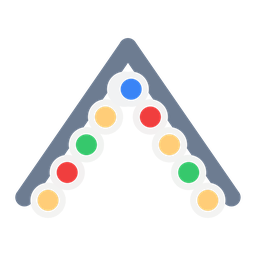

# Gemstone Lights for Home Assistant

A custom integration for [Gemstone Lights](https://www.gemstonelights.com/)
permanent outdoor lighting, controlling the **Hub2** controller from Home
Assistant.

Gemstone does not publish an API (one is expected in 2027). This integration
drives the controller **directly over your LAN** where possible, falling back
to Gemstone's cloud for the things only the cloud can answer.

## Features

- **Light entity** - on/off, RGB colour, brightness, and all 29 built-in
  animations exposed as Home Assistant effects (chase, fireworks, glitter,
  marquee, pacman, spectrum, wave, and more).
- **A light per zone** - every zone you created in the Gemstone app becomes its
  own light with its own colour and effect, much like WLED segments. The names
  are yours, whatever you called them, and zones added or renamed later are
  picked up without reconfiguring anything. This is how you drive front and
  back independently.
- **Effect speed** - a slider that also re-applies the running effect.
- **Design select** - play any design saved in the Gemstone app.
- **Pattern select** - play any pattern saved in your account's folders.
- **The whole official library** - Gemstone publishes well over a thousand
  patterns. Browsing them is split across two dropdowns, *Library folder* and
  *Library pattern*, because no single list of that size is usable. Automations
  can reach any of them directly with the `play_library_pattern` service.
- **Now playing sensor** - what the controller is currently showing, plus
  firmware, output names and local IP as attributes.
- Devices and zones are discovered automatically across every homegroup.
- **Local control** - commands go straight to the controller on your network,
  so they apply immediately and keep working when the internet is down. The
  address is discovered automatically; the cloud is used only as a fallback and
  for the saved-design/pattern catalog.

Effects and colours are built on the fly, so you are not limited to patterns
you saved in the app first.

## Installation

### HACS (recommended)

1. In HACS, choose **Integrations** → three-dot menu → **Custom repositories**.
2. Add this repository's URL with category **Integration**.
3. Install **Gemstone Lights**, then restart Home Assistant.

### Manual

Copy `custom_components/gemstone_lights` into your Home Assistant
`custom_components` directory and restart.

## Setup

**Settings → Devices & Services → Add Integration → Gemstone Lights**, then sign
in with the same email and password you use in the Gemstone Lights app.

Your credentials are stored in the config entry so the integration can renew its
session; Gemstone's tokens are short-lived and its refresh tokens expire after
roughly 30 days. If the password ever changes, Home Assistant will prompt you to
re-authenticate.

## Local control

Nothing to set up. You sign in with your Gemstone account and that is it.

"Allow Local Commands" (Device Settings → Advanced Settings in the Gemstone
app) is what opens the controller's HTTP port. That switch can also be set
through the cloud, so if it is off the integration turns it on for you. Untick
**Switch on local control on the controller** in the integration's options if
you would rather set it yourself in the app. The controller reports its own LAN address and
whether local commands are enabled to Gemstone, so the integration reads both
from your account and switches to local by itself, with no IP to type in. The *Now playing* sensor's `control` attribute shows which
path is in use.

If the controller moves to a new address, the integration notices and follows
it. If it cannot be reached — local commands switched off, or Home Assistant on
a network that cannot see it — it stays on the cloud and retries every few
minutes rather than delaying each update.

To pin an address or force the cloud, use **Configure** on the integration.

### What each path can do

Verified against a Hub2 on firmware 1.1.5.

| | Local | Cloud |
| --- | --- | --- |
| On/off | yes | yes |
| Solid colour | yes, with a real brightness field | yes, brightness folded into the colour |
| Animated pattern (whole run) | yes | yes |
| Per-zone solid colour | yes, via `staticColors` | yes |
| Per-zone animated effect | no | yes |
| Saved designs, zones, pattern catalog | no | yes |
| Firmware, pixel counts, RGBW order | yes | no |

The controller understands `staticColors` (explicit pixel indices) but not
`zonePatterns`; zones are a cloud concept that the cloud expands into pixel
ranges. So an all-solid zone layout is sent locally, and a layout containing
any animation is sent through the cloud. The integration picks per command.

The cloud is also still used for account discovery, saved designs, zone
definitions and the pattern catalog, because the controller does not serve
those.

### A quirk worth knowing

The controller silently ignores writes that arrive back to back: it answers
`200` and keeps its previous state. The integration serialises writes and
spaces them, which is why a burst of rapid commands settles a second or two
later rather than being lost.

## The pattern library

Gemstone's official library is fetched from your account and refreshed daily:
roughly 1,700 patterns across 68 folders, grouped into categories such as
sports, holidays and everyday.

Pick a folder in **Library folder**, then a pattern in **Library pattern**;
choosing a folder does not change the lights. From an automation, skip the
browsing:

```yaml
action: gemstone_lights.play_library_pattern
target:
  entity_id: light.your_controller
data:
  pattern: Happy New Year
  folder: holidays / Chinese New Year   # optional
```

An unknown name fails with a list of near matches rather than silently doing
nothing. Turn the library off in the integration's options if you do not want
it loaded.

## Notes and limitations

- **Brightness** is a real, separate value over local control. Over the cloud
  there is no brightness field for a solid colour, so it is folded into the
  colour instead.
- **Brightness applies to whatever is playing.** Dimming the light while a
  saved pattern, library pattern or design is on re-sends that same content
  with the new brightness, so multi-colour patterns and per-zone designs are
  kept. Changing only the effect likewise keeps the pattern's colours.
- **State lags slightly.** The cloud takes a moment to reflect a change, so the
  integration re-reads state a couple of seconds after each command and polls
  every 30 seconds.
- **Music mode and playlists** are not implemented.

## The local API

Served unauthenticated on port 80 once "Allow Local Commands" is enabled. This
is the interface the vendor's own Control4 and Elan drivers use, and it is
verified working against a Hub2 on firmware 1.1.5.

```http
GET  /device-state/currently-playing   -> state.reported.currentlyPlaying
GET  /device-state/hub-settings        -> state.reported.hubSettings
POST /device-control/play
```

```json
{"state": {"desired": {"currentlyPlaying": {
  "onState": true,
  "colorB": {"value": 255, "brightness": 180},
  "pattern": null, "architectural": null, "impulse": null, "playlist": null
}, "origin": "control4"}}}
```

`currentlyPlaying` carries `onState` plus exactly one of `colorB`, `pattern` or
`architectural`; send the others as null. Power changes send `onState` alone so
the controller keeps showing what it had. Payloads are limited to 15 KiB.
`hub-settings` reports firmware, per-output pixel counts and the RGBW ordering.

## Colour format

Colours are packed as **`R | G << 8 | B << 16 | W << 24`** — little-endian
RGBW, so the hex reads `WWBBGGRR`. Red is `255`, green `65280`, blue
`16711680`, and the dedicated white channel `4278190080`. Note that the last of
those cannot be expressed as 24-bit RGB, which is the giveaway that these are
RGBW fixtures with a real white channel rather than plain RGB.

## The cloud API, for anyone building on this

Everything below was determined by observing the official Android app. It is
recorded here so nobody has to repeat the work.

Auth is **AWS Cognito** (user pool `us-west-2_rr5lY7Etr`, client
`2647t144niotrl53vvru0ivno7`, SRP). Requests then carry a plain bearer token —
**there is no AWS request signing**, despite the error messages suggesting
otherwise.

Base URL: `https://mytpybpq12.execute-api.us-west-2.amazonaws.com/prod`

Required headers:

```
authorization: Bearer <cognito access token>
app-environment: Production
content-type: application/json
```

Two traps cost the most time:

1. **All writes are `PUT`.** Sending `POST` returns
   `Invalid key=value pair (missing equal-sign) in Authorization header`, which
   looks like a SigV4 signing failure and is thoroughly misleading.
2. **The query parameter name differs by endpoint.** Most take
   `deviceOrGroupId`; the architectural (per-zone) endpoints take `deviceId`.

| Method | Path | Params | Body |
| --- | --- | --- | --- |
| GET | `/homegroup/list` | | |
| GET | `/homegroup/devices` | `homegroupId` | |
| GET | `/deviceControl/currentlyPlaying` | `deviceOrGroupId` | |
| GET | `/deviceControl/zone/list` | `deviceId` | |
| GET | `/deviceControl/architectural/list` | `deviceId` | |
| GET | `/folders/list` | | |
| GET | `/folders/pattern/list` | `folderId` | |
| PUT | `/deviceControl/onState` | `deviceOrGroupId` | `{"onState": true}` |
| PUT | `/deviceControl/play/color` | `deviceOrGroupId` | `{"color": 65280}` |
| PUT | `/deviceControl/play/pattern` | `deviceOrGroupId` | `{"pattern": {...}}` |
| PUT | `/deviceControl/play/architectural` | `deviceId` | `{"architectural": {...}}` |
| PUT | `/deviceControl/deviceSettings` | `deviceId` | `{"tcpEnabled": true}` |

`deviceSettings` also reports `localIp`, `pixelCount` and `tcpEnabled`. Setting
`tcpEnabled` genuinely opens and closes the controller's local HTTP port, so
local control can be switched on without touching the app.

Patterns do not have to exist in the account: the controller will play any
well-formed pattern object, which is what makes free-form effect selection
possible. A pattern looks like:

```json
{"name": "…", "colors": [16711680], "animation": "chase", "speed": 200,
 "brightness": 255, "direction": 0, "backgroundColor": 0, "id": "<uuid>"}
```

Valid `animation` values are the 29 names shipped with the app: accent, around,
chase, eyeball, fade, fireworks, flicker, flow, ghost, glitch, glitter,
gradient, gradient_wave, isofade, marquee, motionless, multipulse, pacman,
pulse, pyramid_chase, smooth, spectrum, spotlight, stack, starry, stretch,
sway, tremor, wave.

Per-zone output uses an architectural design whose `zonePatterns` list maps a
`zoneId` (from `/deviceControl/zone/list`) to a pattern. The call replaces the
whole design, so send every zone you want lit on each request.

`currentlyPlaying` returns `onState`, `color`,
`pattern`, `architectural` and `playlist`, where only one of the last three is
set at a time. Pattern bodies are the `patternData` object from
`/folders/pattern/list`; design bodies are an object from
`/deviceControl/architectural/list` with `preview: false` added.

## Credits

The local protocol was recovered independently from the vendor's Control4 and
Elan drivers, which agree on it. Thanks to that work for making local control
possible.

## Disclaimer

Not affiliated with, endorsed by, or supported by Gemstone Lights. It relies on
a private API that the vendor may change at any time. Use at your own risk.

## License

MIT
